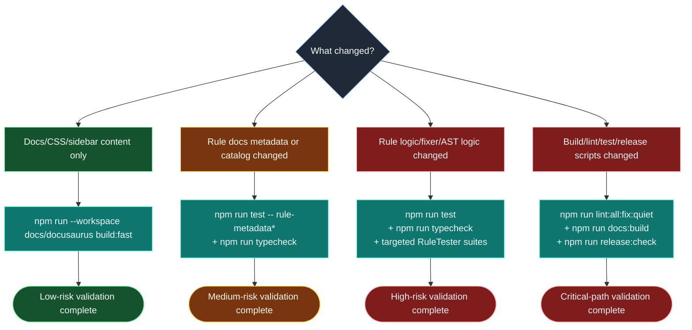

# Change impact and validation matrix

This flowchart helps maintainers choose the minimum safe validation set for each class of change.

## Suggested usage

- Use this matrix during PR review to agree on validation scope upfront.
- Escalate to the next validation tier if a change touches multiple categories.
- Prefer over-testing rather than under-testing for release-adjacent changes.
