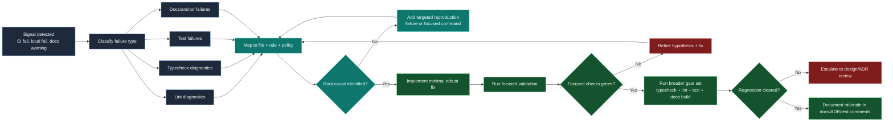

# Diagnostics and regression triage loop

This chart captures the expected maintainer response when lint/type/test/docs gates report regressions.

## Why this matters

- Prevents symptom-fixing loops by requiring explicit root-cause confirmation.
- Keeps maintainers from skipping from one failing gate to broad speculative edits.
- Encourages reproducible regression tests before high-risk refactors.

## Command strategy

- Start focused: single file diagnostics or targeted tests.
- Expand only after local root cause is stable.
- Finish with full quality gates for merge confidence.
