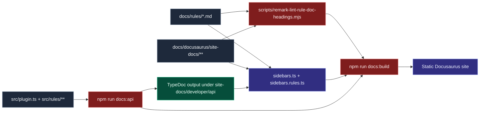

# Docs and API pipeline

This flow highlights the relationship between authored docs, generated API docs, sidebar wiring, and final Docusaurus output.

## Operational guidance

- Treat TypeDoc output as generated artifacts; edit source code, not generated files.
- Keep sidebars aligned with file paths and generated API entrypoints.
- Use full docs build in CI for confidence that rule docs and API docs stay synchronized.

## Troubleshooting signals

- If API pages drift, inspect `npm run docs:api` output first.
- If pages disappear from nav, validate `sidebars.ts` / `sidebars.rules.ts` IDs.
- If Markdown linting fails, run docs checks before full build to shorten feedback loops.
