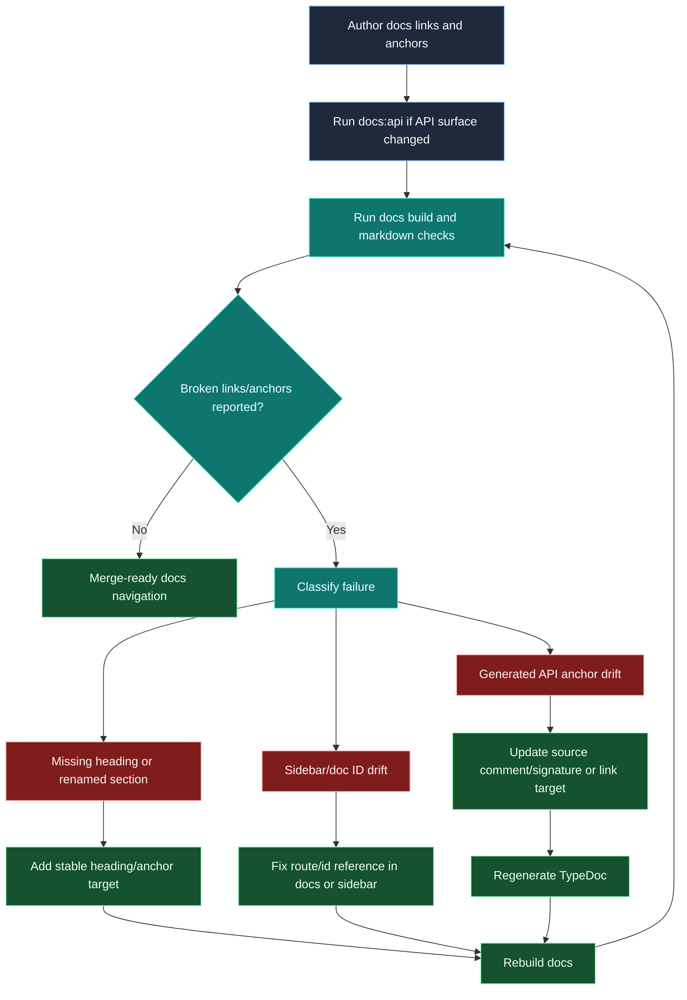

# Docs link integrity and anchor stability

This chart captures how documentation links should be authored, validated, and repaired to keep navigation trustworthy across manual and generated pages.



## Maintainer policy cues

- Prefer durable section headings for frequently referenced anchors.
- Avoid linking to generated anchors when a stable page-level section can be used instead.
- Treat repeated anchor breakage as a documentation architecture issue, not a one-off typo.

## Suggested command sequence

```bash
npm run docs:api
npm run docs:build
```

For docs-only edits where speed matters:

```bash
npm run --workspace docs/docusaurus build:fast
```
