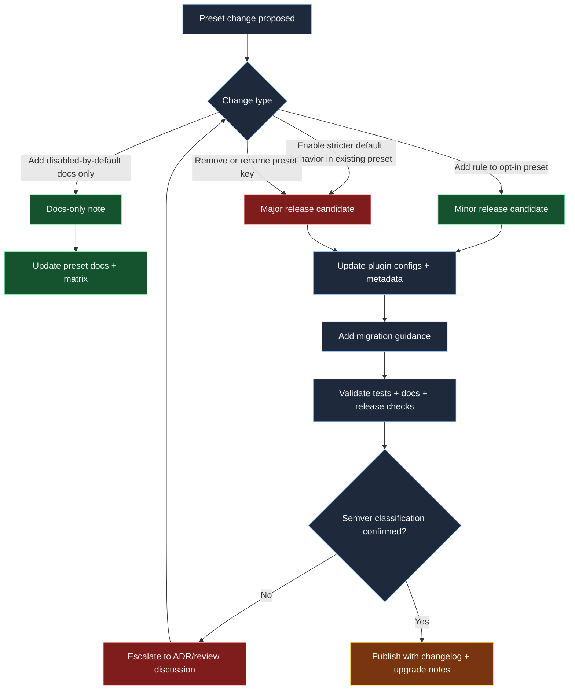

# Preset semver and deprecation lifecycle

This chart defines the expected semver-aware flow when preset membership changes are proposed.

## Maintainer guidance

- Preset key removals and stricter defaults are major-change candidates.
- Preset additions can be minor when existing behavior stays intact.
- Every preset-impacting change should include explicit migration notes.
