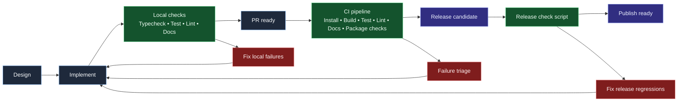

# Quality gates and release flow

This diagram shows the expected quality path from implementation through release readiness, including failure loops.

## Gate intent

- **Typecheck/Test/Lint** protect runtime correctness and rule quality.
- **Docs build** ensures documentation and API pages remain valid.
- **Package checks** prevent broken public artifacts.
- **Release check** is the final integrated confidence pass.

## Command mapping

- Local quality gates: `npm run typecheck`, `npm run test`, `npm run lint:all:fix:quiet`
- Documentation confidence: `npm run docs:build` (or `npm run --workspace docs/docusaurus build:fast` for quick docs-only edits)
- Release hardening: `npm run release:check`
