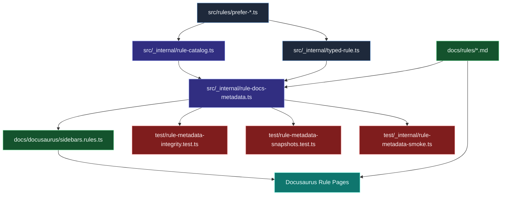

# Rule catalog and docs synchronization

Use this diagram to understand how a single rule change propagates through catalog identity, docs metadata, and validation tests.

## Why this matters

- Stable catalog IDs prevent accidental reorder/regression bugs in rule references.
- Metadata tests catch drift between source metadata and docs content early.
- Sidebars and generated docs stay deterministic when source-of-truth metadata is consistent.

## Common maintenance workflow

1. Update rule logic and `meta.docs` fields in the rule source.
2. Confirm catalog identity and metadata extraction remain aligned.
3. Update rule docs if examples/options changed.
4. Run metadata-integrity + snapshot tests before merging.
