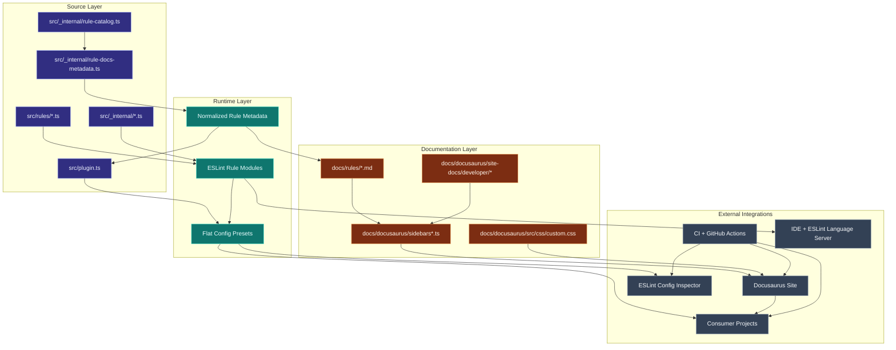

# System architecture overview

This diagram shows how source modules, rule metadata, docs, generated tooling assets, and consumer projects fit together.

## Notes

- The rule catalog provides stable IDs for traceability (`R001`, `R002`, ...).
- `createTypedRule` centralizes rule metadata and type-aware wiring.
- Rule docs and Docusaurus sidebars remain aligned through shared metadata conventions.

## How to read this diagram

- **Source layer** is where maintainers edit behavior and contracts.
- **Runtime layer** is what ESLint and consumers execute directly.
- **Documentation layer** controls generated/static docs discoverability.
- **External integrations** represent CI, IDE, and published artifact entry points.
