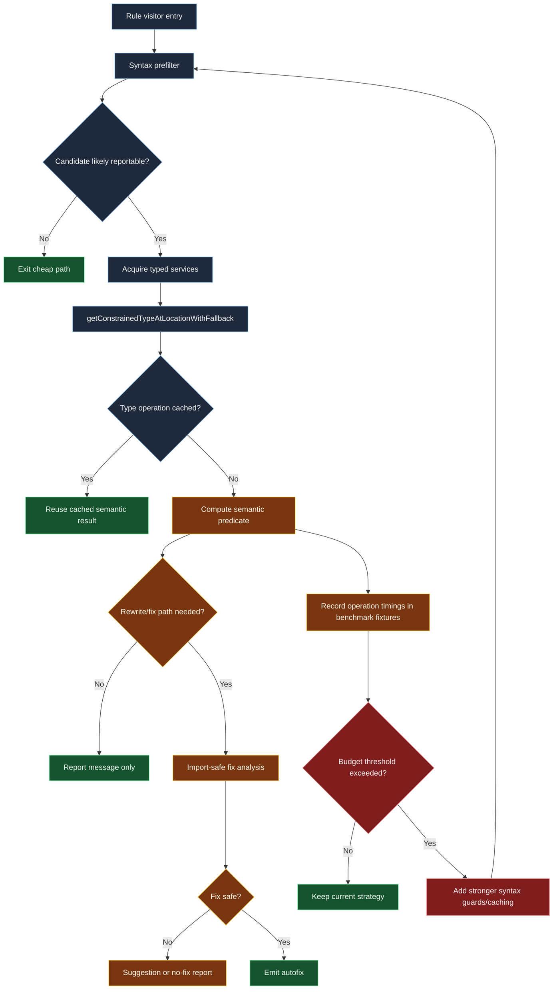

# Typed rule performance budget and hotspots

Use this chart to reason about where semantic rules spend time and where to place guardrails before regressions land in CI.

## Budget policy cues

- Treat semantic type resolution as an expensive tier after syntax prefilters.
- Prefer memoized expression predicates for repeated patterns.
- Escalate benchmark regressions before adding new typed checks in hot visitors.

## Maintainer checklist

1. Add syntax short-circuits before any checker call.
2. Cache repeated type analyses where AST identity is stable.
3. Verify benchmark fixtures when rule logic expands semantic coverage.
