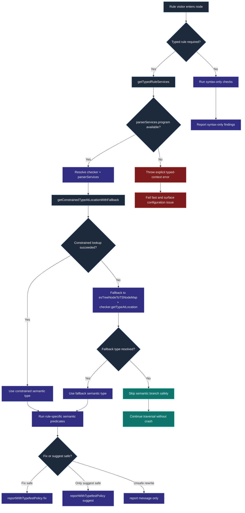

# Typed rule semantic analysis flow

This chart focuses on the semantic path used by typed rules, including service acquisition, constrained-type lookup fallback, and guarded reporting behavior.

## Maintainer interpretation

- Treat semantic calls as a guarded path, not a default path.
- `getConstrainedTypeAtLocationWithFallback` is the main reliability bridge between ideal type information and resilient fallback behavior.
- Fail-fast behavior is intentional for typed-rule contexts and should not be replaced with silent degradation.

## Operational checkpoints

1. If users report typed-rule crashes, verify parser service availability first.
2. If semantic branches become expensive, add syntax-level short-circuits before type operations.
3. Keep report/fix policy centralized to prevent per-rule drift in rewrite safety.
